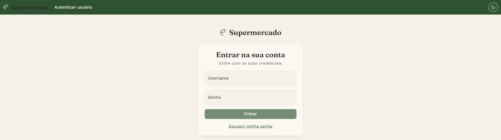
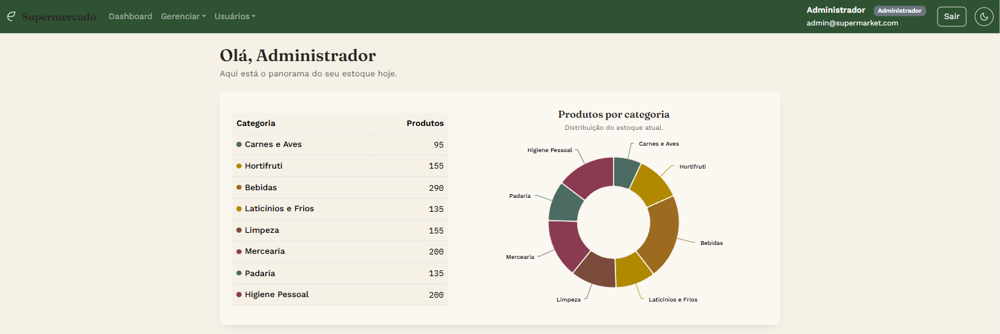
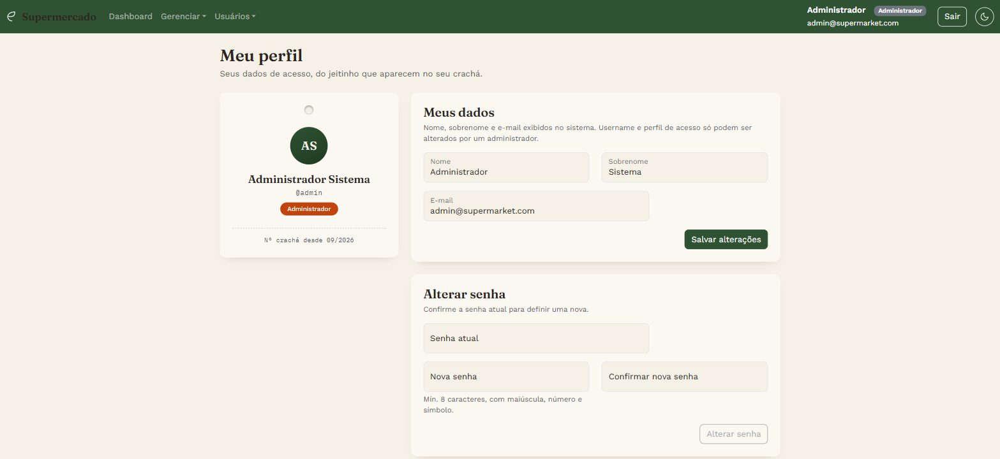
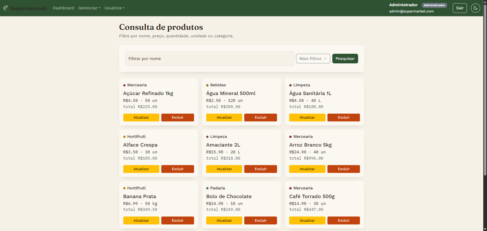
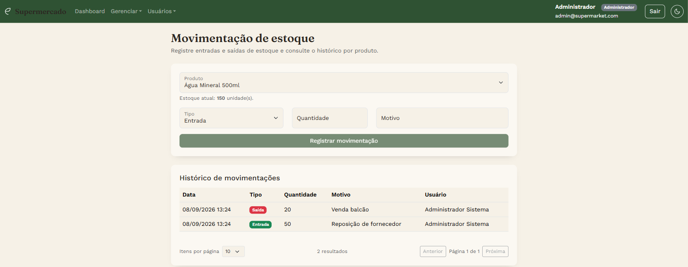

# Supermercado Web


[🇺🇸 Read in English](#supermarket-web)

🖥️ Front-end desenvolvido em **Angular e Bootstrap** para controle e gerenciamento de um supermercado — produtos, categorias, estoque e usuários — consumindo a [Supermarket API](https://github.com/samuelmsilva2v/supermarket-api). Interface responsiva, com autenticação, autoatendimento de conta e um dashboard visual do estoque.

## Capturas de tela

| | |
|---|---|
| <br>Login | <br>Dashboard |
| <br>Meu perfil (autoatendimento) | <br>Consulta de produtos |
| <br>Movimentação de estoque | |

## Funcionalidades
* **Dashboard** com gráfico de produtos cadastrados por categoria.

* **Produtos:** cadastro, edição, exclusão e consulta com filtros (nome, preço, quantidade, unidade de medida e categoria), paginada.

* **Categorias:** cadastro, edição, exclusão e consulta por nome, paginada.

* **Movimentação de estoque:** registro de entradas e saídas, com histórico paginado por produto.

* **Login e recuperação de senha:** autenticação por username/senha, com opção de solicitar uma nova senha por e-mail em caso de esquecimento.

* **Meu perfil (autoatendimento):** qualquer usuário autenticado edita o próprio nome/sobrenome/e-mail e troca a própria senha, sem depender de um administrador. A navbar reflete as mudanças na hora, sem precisar recarregar a página.

* **Gerenciamento de usuários** *(restrito a administradores)*: cadastro, consulta com filtros, edição e ativação/inativação de usuários.

* **Tema claro/escuro**, com preferência salva localmente.

### Regras de negócio
As regras de negócio (nomes duplicados, exclusão de produtos com estoque, senha com requisitos de complexidade, etc.) são impostas pela [Supermarket API](https://github.com/samuelmsilva2v/supermarket-api) — o front-end reflete os erros retornados por ela nos formulários, campo a campo quando possível.

No front-end especificamente:
* `AuthGuard` bloqueia o acesso a qualquer página que não seja login ou recuperação de senha para quem não está autenticado.
* `AdminGuard` restringe cadastro, consulta e edição de usuários a quem tem perfil `Administrador` — a navbar só exibe esses links quando ambas as condições são satisfeitas.

## Tecnologias Utilizadas
#### Front-end (Web):
* Angular 19 (standalone components, sem NgModules)
* Bootstrap 5
* HttpClient + interceptor funcional (anexa o token JWT automaticamente às requisições)
* Angular Reactive Forms
* Angular Signals (estado reativo de sessão/tema, ex.: a navbar atualiza sozinha após uma edição de perfil)
* Angular Highcharts (construção do dashboard)
* Angular Guards (`AuthGuard`, `AdminGuard`)
#### Back-end (consumido por este front-end):
* Java 21 / Spring Boot
* JWT (autenticação)
* PostgreSQL
* RabbitMQ + Mailpit (recuperação de senha por e-mail)

## Páginas / Rotas

| Rota                             | Acesso                  | Descrição                                              |
|-----------------------------------|--------------------------|-----------------------------------------------------------|
| `/pages/autenticar-usuario`      | Pública                  | Login                                                      |
| `/pages/esqueci-senha`           | Pública                  | Solicitar uma nova senha por e-mail                        |
| `/pages/dashboard`               | Autenticado              | Painel com gráfico de produtos por categoria               |
| `/pages/consulta-produtos`       | Autenticado              | Consulta de produtos, com filtros                          |
| `/pages/cadastro-produtos`       | Autenticado              | Cadastro de produto                                        |
| `/pages/edicao-produtos/:id`     | Autenticado              | Edição de produto                                          |
| `/pages/consulta-categorias`     | Autenticado              | Consulta de categorias                                     |
| `/pages/cadastro-categorias`     | Autenticado              | Cadastro de categoria                                      |
| `/pages/edicao-categorias/:id`   | Autenticado              | Edição de categoria                                        |
| `/pages/movimentacao-estoque`    | Autenticado              | Registro e histórico de movimentações de estoque            |
| `/pages/meu-perfil`              | Autenticado              | Autoatendimento: editar dados e trocar a própria senha      |
| `/pages/criar-usuario`           | Autenticado + Admin      | Cadastro de usuário                                        |
| `/pages/consulta-usuarios`       | Autenticado + Admin      | Consulta de usuários, com filtros                          |
| `/pages/edicao-usuarios/:id`     | Autenticado + Admin      | Edição e ativação/inativação de usuário                    |

## Instalação e Configuração

### Pré-requisitos
- Node.js e Angular CLI
- A [Supermarket API](https://github.com/samuelmsilva2v/supermarket-api) rodando localmente — este front-end depende dela para autenticação e dados (veja o README de lá para subir o back-end, o Postgres, o RabbitMQ e o Mailpit via Docker)

**1. Clonar o Repositório**
```bash
git clone https://github.com/samuelmsilva2v/supermarket-web.git
cd supermarket-web
```

**2. Instalar as dependências do projeto**
```bash
npm install
```

**3. Executar o front-end**
```bash
ng s -o
```
Isso irá iniciar o servidor de desenvolvimento na URL http://localhost:4200/. Você pode abrir seu navegador e acessar essa URL para visualizar a aplicação.

Para apontar o front-end a um back-end em outro endereço, edite `src/app/configurations/environment.ts` (constante `supermarketApi`).

### Testes
Para rodar os testes automatizados
```bash
ng test
```

---

# Supermarket Web
[🇧🇷 Leia em Português](#supermercado-web)

🖥️ Front-end built with **Angular and Bootstrap** for managing a supermarket — products, categories, stock and users — consuming the [Supermarket API](https://github.com/samuelmsilva2v/supermarket-api). Responsive UI, with authentication, account self-service and a visual stock dashboard.

## Screenshots

| | |
|---|---|
| <br>Login | <br>Dashboard |
| <br>My profile (self-service) | <br>Product search |
| <br>Stock movements | |

## Features
* **Dashboard** with a chart of registered products by category.

* **Products:** create, edit, delete and search with filters (name, price, quantity, unit of measure and category), paginated.

* **Categories:** create, edit, delete and search by name, paginated.

* **Stock movements:** register inbound/outbound movements, with a paginated history per product.

* **Login and password recovery:** username/password authentication, with the option to request a new password by e-mail if forgotten.

* **My profile (self-service):** any authenticated user edits their own name/surname/e-mail and changes their own password, without needing an administrator. The navbar reflects changes instantly, no page reload required.

* **User management** *(admin-only)*: create, search, edit and activate/deactivate users.

* **Light/dark theme**, saved locally.

### Business Rules
Business rules (duplicate names, deleting products with stock, password complexity requirements, etc.) are enforced by the [Supermarket API](https://github.com/samuelmsilva2v/supermarket-api) — the front-end surfaces the errors it returns in the forms, field by field where possible.

On the front-end specifically:
* `AuthGuard` blocks access to any page other than login or password recovery for unauthenticated users.
* `AdminGuard` restricts user creation, search and editing to users with the `Administrador` role — the navbar only shows those links when both conditions are met.

## Technologies Used
#### Front-end (Web):
* Angular 19 (standalone components, no NgModules)
* Bootstrap 5
* HttpClient + a functional interceptor (automatically attaches the JWT token to requests)
* Angular Reactive Forms
* Angular Signals (reactive session/theme state — e.g. the navbar updates itself after a profile edit)
* Angular Highcharts (dashboard construction)
* Angular Guards (`AuthGuard`, `AdminGuard`)
#### Back-end (consumed by this front-end):
* Java 21 / Spring Boot
* JWT (authentication)
* PostgreSQL
* RabbitMQ + Mailpit (e-mail-based password recovery)

## Pages / Routes

| Route                             | Access                  | Description                                              |
|-------------------------------------|---------------------------|---------------------------------------------------------------|
| `/pages/autenticar-usuario`        | Public                    | Login                                                          |
| `/pages/esqueci-senha`             | Public                    | Request a new password by e-mail                               |
| `/pages/dashboard`                 | Authenticated             | Dashboard with a chart of products by category                |
| `/pages/consulta-produtos`         | Authenticated             | Product search, with filters                                   |
| `/pages/cadastro-produtos`         | Authenticated             | Product registration                                           |
| `/pages/edicao-produtos/:id`       | Authenticated             | Product editing                                                |
| `/pages/consulta-categorias`       | Authenticated             | Category search                                                |
| `/pages/cadastro-categorias`       | Authenticated             | Category registration                                          |
| `/pages/edicao-categorias/:id`     | Authenticated             | Category editing                                                |
| `/pages/movimentacao-estoque`      | Authenticated             | Stock movement registration and history                        |
| `/pages/meu-perfil`                | Authenticated             | Self-service: edit your own data and change your own password  |
| `/pages/criar-usuario`             | Authenticated + Admin     | User registration                                               |
| `/pages/consulta-usuarios`         | Authenticated + Admin     | User search, with filters                                      |
| `/pages/edicao-usuarios/:id`       | Authenticated + Admin     | User editing and activation/deactivation                       |

## Installation and Configuration

### Prerequisites
- Node.js and Angular CLI
- The [Supermarket API](https://github.com/samuelmsilva2v/supermarket-api) running locally — this front-end depends on it for authentication and data (see its README to bring up the back-end, Postgres, RabbitMQ and Mailpit via Docker)

**1. Clone the Repository**
```bash
git clone https://github.com/samuelmsilva2v/supermarket-web.git
cd supermarket-web
```

**2. Install the project dependencies**
```bash
npm install
```

**3. Run the front-end**
```bash
ng s -o
```
This will start the development server at URL http://localhost:4200/. You can open your browser and access this URL to view the application.

To point the front-end at a back-end running elsewhere, edit `src/app/configurations/environment.ts` (the `supermarketApi` constant).

### Testing
To run automated tests
```bash
ng test
```
